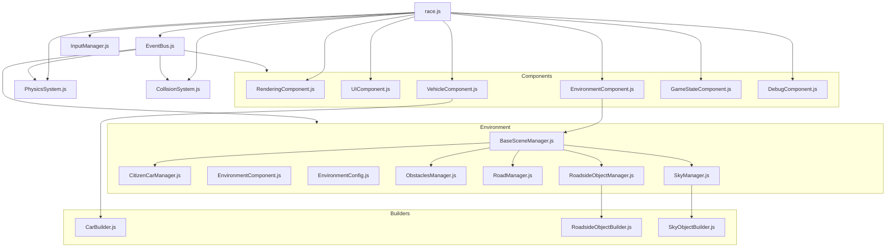

# Racing Game 

## Architecture Diagram

## Project Structure

The racing game follows a component-based architecture with the following main elements:

* **Entry Point**: race.js serves as the main entry point that initializes the game

* **Core Systems**:
  * EventBus.js: Communication system between components
  * PhysicsSystem.js: Handles physics simulation
  * CollisionSystem.js: Manages collision detection
  * InputManager.js: Processes user input
* **Components:**
  * RenderingComponent.js: Handles game rendering
  * UIComponent.js: Manages UI elements
  * VehicleComponent.js: Controls vehicle behavior
  * EnvironmentComponent.js: Manages game environment
  * GameStateComponent.js: Tracks game state
  * DebugComponent.js: Provides debugging tools
* **Environment**:
  * BaseSceneManager.js: Core scene management
  * Specialized managers:
    * CitizenCarManager.js
    * RoadManager.js
    * RoadsideObjectManager.js
    * SkyManager.js
    * ObstaclesManager.js
* **Builders**:
  * CarBuilder.js: Creates car objects
  * RoadsideObjectBuilder.js: Creates roadside objects
  * SkyObjectBuilder.js: Creates sky elements
  
## Dependencies

The game utilizes the Three.js library for 3D rendering, loaded via CDN as specified in the import map in `race.html`.

## Development

The game runs in a browser and features:

* Vehicle controls (acceleration, braking, steering)
* Multiple camera modes
* Environment with roads, obstacles, other vehicles, and scenery
* Score tracking and statistics
* Mobile support with touch controls

---
This game and its architecture diagram were fully generated with Claude Sonnet 3.5 and 3.7.